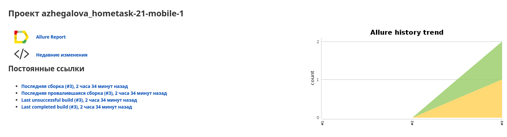
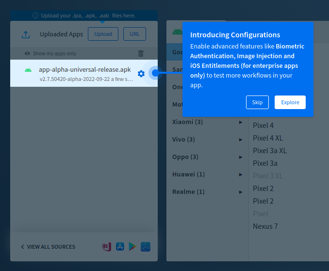

QA.GURU | Java | Автоматизация тестирования | Мобильная автоматизация

Тема задания:

* Разработка автотестов с Android studio.

Задание:

* Установить <a target="_blank" href="https://developer.android.com/studio/">Android studio</a>.
* Установить <a target="_blank" href="https://github.com/appium/appium-desktop/">Appium desktop</a>.
* Установить <a target="_blank" href="https://github.com/appium/appium-inspector/">Appium inspector</a>.
* Запустить эмулятор телефона, опробовать кнопки и функционал.
* Открыть Appium Desktop, запустить server.
* Открыть Appium Inspector, проконектиться к эмулятору.
* Изучить функционал Appium Inspector.
* Разработать автотест на getting started (onboarding screen) в приложении Wikipedia - пройти по 4м экранам, на каждом сделать проверку.

Ссылки на выполненное задание в:

* <a target="_blank" href="https://jenkins.autotests.cloud/job/azhegalova_hometask-21-mobile-1/3/allure/">Jenkins job</a>.

Скриншоты:

